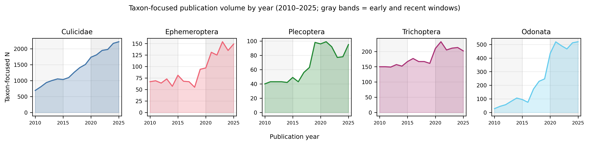
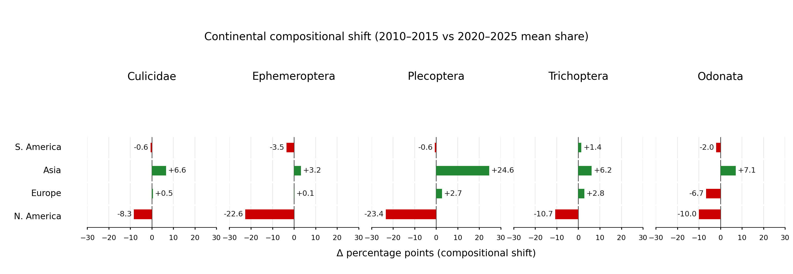
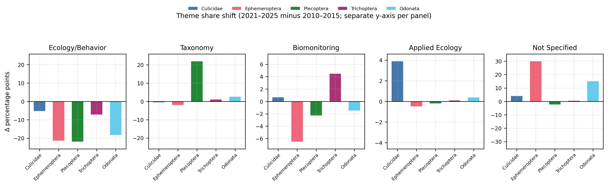
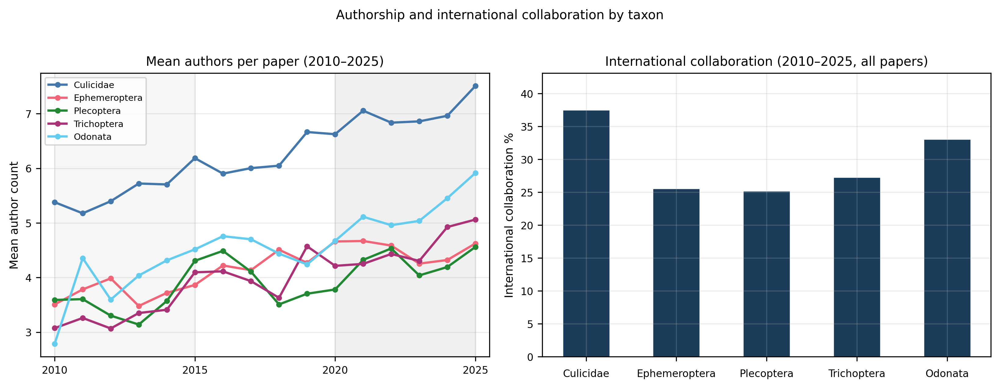

# Geographic Shifts and Thematic Evolution in Aquatic Insect Research: A Comparative Bibliometric Analysis of Culicidae, EPT Taxa, and Odonata (2010–2025)

## 1. Introduction

Aquatic insects are among the most important organisms in freshwater ecosystems, contributing to nutrient cycling, energy transfer, decomposition, and predator–prey interactions. Because many species are sensitive to environmental disturbance, aquatic insects are also widely used as indicators of water quality and ecosystem health. Consequently, they have been the focus of extensive research across ecology, conservation, biomonitoring, taxonomy, evolution, and environmental management.

The aquatic insect groups examined in this study differ substantially in both their ecological roles and relevance to human society. Ephemeroptera (mayflies), Plecoptera (stoneflies), and Trichoptera (caddisflies), collectively EPT taxa, are widely used in freshwater biomonitoring because many species are sensitive to pollution and habitat degradation. Odonata (dragonflies and damselflies) are important aquatic predators and are frequently studied as indicators of biodiversity and habitat quality. In contrast, Culicidae (mosquitoes) are among the most intensively studied aquatic insects because of their role as vectors of diseases affecting humans and wildlife. These differences in ecological function and societal importance may influence research priorities, publication output, the geographic distribution of studies, and patterns of scientific collaboration.

Despite extensive literature on each group, few studies have compared publication patterns across aquatic insect taxa with the same methods and time window. We applied one parallel bibliometric workflow to Scopus records from 2010 to 2025 for Culicidae, Ephemeroptera, Plecoptera, Trichoptera, and Odonata, using separate searches and coded datasets for each taxon, summarized with identical rules. A secondary Scopus–Google Scholar comparison for 2023 checked database overlap but was not the main focus of the paper.

We addressed four questions:

1. How do Scopus and Google Scholar overlap in their coverage of literature on each taxon?
2. How has taxon-focused publication output changed over time and across geographic regions?
3. What research themes dominate the literature for each taxon, and how have they shifted over time?
4. What are the patterns of authorship and international collaboration across taxa and among research specialties?

The study centers on taxon-focused papers (those in which the target taxon is a primary or secondary focus, not a passing mention). We expected Culicidae, as a medically important vector group, to show the largest literature and a more applied thematic profile, whereas EPT taxa and Odonata would emphasize ecology, biomonitoring, and taxonomy. We also examined whether continental distributions of study locations, theme mixes, and collaboration patterns diverged in parallel across groups over the 2010–2025 period.

## 2. Methods

### 2.1 Study design and data collection

We applied one bibliometric workflow to five aquatic insect taxa (Table 1): Culicidae; Ephemeroptera, Plecoptera, and Trichoptera (EPT, three separate searches); and Odonata. Each taxon had its own Scopus and Google Scholar searches, processed files, and coded dataset (records were not merged across taxa).

**Table 1. Scopus search queries by taxon** (terms searched in title, abstract, and keywords)

| Taxon | Search terms |
| --- | --- |
| Culicidae | mosquito, mosquitoes, Culicidae |
| Ephemeroptera | Ephemeroptera, mayfly, mayflies |
| Plecoptera | Plecoptera, stonefly, stoneflies |
| Trichoptera | Trichoptera, caddisfly, caddisflies, caddis fly, caddis flies |
| Odonata | Odonata, dragonfly, dragonflies, damselfly, damselflies |

Publications were retrieved with Elsevier’s Scopus Search API using the queries in Table 1. Calendar years 2010–2025 were fetched sequentially; large years were subdivided into months or quarters to stay within API pagination limits. The API supplied standard bibliographic metadata (title, journal, year, DOI, citations, document type). Full abstracts and complete author lists were often missing and were obtained as described in section 2.2.

The Scopus API was queried in May 2026. Because Scopus indexing lags publication, 2025 records may be incompletely captured at this retrieval date; counts and shares for 2025 should therefore be read as lower bounds, and recent-window (2020–2025) totals are likely slightly conservative.

For database comparison, taxon-matched Google Scholar results for 2023 were retrieved with Publish or Perish using the same search terms as in Table 1 (1,000-result cap per query). Scopus records for the same year used the workflow above.

### 2.2 Data processing and metadata enrichment

Yearly Scopus exports were combined and deduplicated in two steps: one row per DOI when present, then one row per normalized title (lowercase, trimmed whitespace; first occurrence retained). Each record kept its publication year for temporal analysis and downstream linking.

Where a DOI was available, missing abstracts were retrieved in fixed order: OpenAlex, Semantic Scholar, CrossRef, then PubMed for biomedical items; the first hit was used. Records without abstracts were still classified; missing abstract text was noted for downstream use. Author lists, author counts, and affiliations were retrieved from OpenAlex via DOI lookup for collaboration analyses and as supplemental geographic context.

### 2.3 Automated classification

Each record retained Scopus bibliographic fields plus four LLM-assigned variables:

- **Country:** primary study country (standard name), or blank if unknown.
- **Global biogeographic region:** Oriental, Neotropical, Nearctic, Palearctic, East Palearctic, Afrotropical, Australasian, Global, or Not Specified (formal biogeographic labels, not map coordinates).
- **Primary research theme:** Taxonomy/Systematics, Ecology/Behavior, Biomonitoring/Water Quality, Evolution/Phylogeny, Conservation, Materials Science (Silk), Physiology, Applied Ecology, Other, or Not Specified. Materials Science (Silk) applies mainly to Trichoptera.
- **Taxon relevance:** Primary focus, Secondary mention, Peripheral, or Not target-taxon-focused.

For continental summaries, biogeographic regions were mapped to South America, Asia, Europe, North America, Other, or Unknown (e.g., Nearctic and Neotropical to North and South America, Palearctic and East Palearctic to Europe and Asia). For selected collaboration comparisons (section 2.4.3), themes were also grouped as *applied* (Biomonitoring/Water Quality, Applied Ecology, Conservation, Materials Science [Silk]), *taxonomic* (Taxonomy/Systematics), or *other* (all remaining themes).

Papers were classified with OpenAI GPT-4o-mini (temperature 0) from title, abstract (or a statement that no abstract was available), and title-matched affiliations. Instructions and category definitions were shared across taxa; each run named the target taxon in the prompt (e.g., Culicidae vs Trichoptera). The model was instructed to assign labels only when supported by the title or abstract, to prefer the most specific applicable category, and not to infer missing study details. Geography prioritized explicit study locations in title/abstract, then other text cues, then affiliations; one primary location when several were mentioned. Theme was a single primary category, with prompt cues separating overlapping labels (taxonomy vs phylogeny, ecology vs biomonitoring, silk-focused materials work). Taxon relevance excluded keyword hits not centered on the taxon. The full prompt is available on request.

### 2.4 Bibliometric analysis

The analyses below correspond to the four questions in the Introduction. Analyses of publication volume, geography, themes, and collaboration used 2010–2025 papers not classified as not target-taxon-focused (Primary focus, Secondary mention, and Peripheral retained). Metrics were computed per taxon with identical rules; combined tables and figures compare all five corpora side by side. The database-overlap analysis (section 2.4.1) used all 2023 records from section 2.1, without the taxon-relevance filter.

#### 2.4.1 Database overlap and coverage

For each taxon, 2023 Scopus and Google Scholar records were paired by DOI, or by title similarity of at least 0.85 on normalized titles when DOIs were absent. We reported overlap, database-unique records, and citation summaries. Language was flagged with a simple character-based rule (non-Latin scripts or common diacritics), not full language identification. Journals were labeled regional when the title suggested national/regional scope, otherwise international/general; missing names were set aside.

#### 2.4.2 Temporal, geographic, and thematic patterns

Publication volume and geography used each taxon’s filtered dataset described above. Countries were harmonized; one primary location was kept when multiple appeared. Summaries were by region and year, with country-level concentration across 2010–2025. Continental shifts compared mean within-year shares between early (2010–2015) and recent (2020–2025) multi-year periods within the study window. Locations reflect LLM-inferred study geography from text, not geocoding of addresses. Theme counts used each paper’s assigned primary research theme, summarized in multi-year bands and by year; ranked cross-taxa theme summaries exclude Not Specified. Theme evolution compared the share of papers in selected primary themes between 2010–2015 (early) and 2020–2025 (recent), reporting the change in percentage points (recent minus early) on taxon-focused papers.

#### 2.4.3 Authorship and collaboration

Author counts used OpenAlex author totals, binned as single author, two, three to five, six to ten, or more than ten for optional per-taxon summaries not reported here. Research specialties were primary themes; selected tables use the applied, taxonomic, and other theme groups defined in section 2.3. International collaboration labels used, in order: multiple vs single ISO country codes in author metadata; if missing, country keywords in affiliation text; if still missing, assigned global region (Global → International; any other specified region → National; Not Specified or missing → Unknown). Author counts and collaboration rates were compared across taxa and among applied and taxonomic theme groups in selected tables.

All early-versus-recent comparisons in sections 2.4.2 and 2.4.3 report descriptive differences between fixed multi-year windows; we did not apply formal inferential trend tests.

### 2.5 Software and reproducibility

Analyses were implemented in Python using pandas and provider API clients for Scopus, OpenAlex, and OpenAI. The same workflow was repeated for each taxon with taxon-specific search strings (Table 1) and classification prompts. Query definitions, prompts, and analysis code are available on request.

## 3. Results

### 3.1 Database overlap and coverage (2023)

Scopus returned very different numbers of 2023 records for each taxon (Table 2). For example, Culicidae returned 4,307 records and Plecoptera returned 153. Google Scholar was searched with the same terms, but each query returned at most 1,000 records (Methods, section 2.1). This comparison used all 2023 search hits matched by DOI or similar title (Methods, sections 2.1 and 2.4.1) and did not apply the taxon-focus screen used in sections 3.2–3.4.

**Table 2. Scopus and Google Scholar coverage by taxon (2023)**

| Metric | Culicidae | Ephemeroptera | Plecoptera | Trichoptera | Odonata |
| --- | ---: | ---: | ---: | ---: | ---: |
| Scopus total | 4,307 | 409 | 153 | 261 | 903 |
| Google Scholar total | 1,000 | 997 | 980 | 993 | 1,000 |
| Overlap (both) | 863 | 369 | 136 | 230 | 400 |
| Overlap / Scopus (%) | 20.0 | 90.2 | 88.9 | 88.1 | 44.3 |

Google Scholar returned close to 1,000 records for every taxon (Table 2), reflecting the export limit. The share of Scopus records also found in Google Scholar ranged from 20.0% (Culicidae) to 88–90% (Ephemeroptera, Plecoptera, and Trichoptera) and was 44.3% for Odonata. Between 136 and 863 records appeared in both databases, depending on taxon.

### 3.2 Temporal and geographic variation (2010–2025)

Taxon-focused publication output rose in every taxon between the early and recent multi-year windows (Table 3). For example, Odonata increased from 413 papers in 2010–2015 to 2,943 in 2020–2025 (+612.6%), the largest relative gain, whereas Trichoptera increased from 925 to 1,273 (+37.6%). Results below use taxon-focused Scopus papers from 2010–2025 (Methods, sections 2.3 and 2.4.2). Between 36.6% and 83.0% of coded records were taxon-focused, depending on taxon (Table 3).

**Table 3. Publication volume (2010–2025)**

| Metric | Culicidae | Ephemeroptera | Plecoptera | Trichoptera | Odonata |
| --- | ---: | ---: | ---: | ---: | ---: |
| All coded papers | 51,990 | 4,062 | 2,272 | 3,456 | 9,203 |
| Taxon-focused papers | 22,664 | 1,486 | 1,057 | 2,870 | 4,079 |
| Taxon-focused (%) | 43.6 | 36.6 | 46.5 | 83.0 | 44.3 |
| Early window (2010–2015) | 5,528 | 411 | 260 | 925 | 413 |
| Recent window (2020–2025) | 11,862 | 791 | 537 | 1,273 | 2,943 |
| Percent change (early vs recent) | 114.6 | 92.5 | 106.5 | 37.6 | 612.6 |

Culicidae accounted for the largest absolute volume in both windows (Table 3). Annual taxon-focused counts rose steadily for Culicidae and increased sharply for Odonata after about 2017 (Figure 1).

**Figure 1.** Taxon-focused publication counts by year, 2010–2025 (arithmetic scale), one panel per taxon in order Culicidae through Odonata. Gray bands mark the early (2010–2015) and recent (2020–2025) windows used in Table 3; each panel uses its own y-axis scale. Window totals are in Table 3.

Continent labels describe where the study took place (Methods, section 2.3), not author addresses alone. Mean continental shares differed across taxa: Culicidae papers were most Asia-weighted (25.4% on average), whereas Ephemeroptera, Plecoptera, and Trichoptera were most Europe-weighted (24–30%). Odonata had the highest Unknown share (28.5%). North America's share fell in every taxon when comparing 2010–2015 with 2020–2025 (Table 4; Figure 2).

**Table 4. Change in mean continental share (percentage points): 2010–2015 vs 2020–2025**

| Continent | Culicidae | Ephemeroptera | Plecoptera | Trichoptera | Odonata |
| --- | ---: | ---: | ---: | ---: | ---: |
| South America | −0.6 | −3.5 | −0.6 | +1.4 | −2.0 |
| Asia | +6.6 | +3.2 | +24.6 | +6.2 | +7.1 |
| Europe | +0.5 | +0.1 | +2.7 | +2.8 | −6.7 |
| North America | −8.3 | −22.6 | −23.4 | −10.7 | −10.0 |

*Other (Afrotropical, Australasian, Global) and Unknown are omitted; the four continents shown need not sum to zero in each column (e.g., Culicidae ≈ −1.8 pp).*

**Figure 2.** Change in mean continental share (percentage points) from 2010–2015 to 2020–2025. Each cell shows one continent–taxon pair as a horizontal bar; green marks a share increase and red a share decrease relative to zero. Rows are continents and columns are taxa (Culicidae through Odonata). Exact values are in Table 4.

### 3.3 Thematic evolution (2010–2025)

Ecology/Behavior was the most common primary research theme for every taxon across the full 2010–2025 window (Table 5). For example, it accounted for 41.8% of Ephemeroptera papers and 38.0% of Culicidae papers, but the second- and third-ranked themes diverged: Culicidae papers were often classified as Applied Ecology (25.9%) or Physiology (13.7%), whereas Trichoptera papers were often Taxonomy/Systematics (31.5%) or Biomonitoring/Water Quality (20.9%). Results use taxon-focused papers from 2010–2025 with one primary theme label each (Methods, sections 2.3 and 2.4.2). Ranks #1–#3 exclude papers labeled Not Specified; Not Specified is reported separately.

**Table 5. Ranked primary research themes by taxon (2010–2025)**

| Rank | Culicidae | Ephemeroptera | Plecoptera | Trichoptera | Odonata |
| --- | --- | --- | --- | --- | --- |
| #1 | Ecology/Behavior (38.0%) | Ecology/Behavior (41.8%) | Ecology/Behavior (36.9%) | Ecology/Behavior (35.4%) | Ecology/Behavior (30.4%) |
| #2 | Applied Ecology (25.9%) | Biomonitoring/Water Quality (25.7%) | Biomonitoring/Water Quality (26.3%) | Taxonomy/Systematics (31.5%) | Taxonomy/Systematics (20.8%) |
| #3 | Physiology (13.7%) | Taxonomy/Systematics (8.3%) | Taxonomy/Systematics (25.4%) | Biomonitoring/Water Quality (20.9%) | Biomonitoring/Water Quality (5.4%) |
| Not Specified | 12.4% | 20.9% | 4.4% | 3.1% | 32.6% |

*Ranks #1–#3 exclude papers labeled Not Specified.*

Culicidae stood apart from the EPT taxa and Odonata in its emphasis on applied and physiological work (Table 5). Plecoptera and Trichoptera had high shares of taxonomy and biomonitoring among their top three themes; Ephemeroptera combined ecology, biomonitoring, and a smaller taxonomy share. Not Specified labels were uncommon for Plecoptera and Trichoptera (3–4%) but much more frequent for Odonata (32.6%) and Ephemeroptera (20.9%).

Theme shares also shifted between early (2010–2015) and recent (2020–2025) bands (Table 6; Figure 3). Ecology/Behavior declined in every taxon, by 4.7 percentage points (pp) for Culicidae and by 18–23 pp for Ephemeroptera, Plecoptera, and Odonata. The largest positive shift was Taxonomy/Systematics for Plecoptera (+24.2 pp). Culicidae showed a modest rise in Applied Ecology (+4.0 pp). Trichoptera showed the largest gain in Biomonitoring/Water Quality (+3.9 pp) among EPT taxa. Not Specified rose sharply for Ephemeroptera (+26.2 pp) and Odonata (+13.9 pp) but changed little for Trichoptera (+0.5 pp) and fell slightly for Plecoptera (−2.6 pp).

**Table 6. Change in theme share (percentage points): 2010–2015 vs 2020–2025**

| Theme | Culicidae | Ephemeroptera | Plecoptera | Trichoptera | Odonata |
| --- | ---: | ---: | ---: | ---: | ---: |
| Ecology/Behavior | −4.7 | −19.8 | −22.7 | −6.0 | −17.9 |
| Taxonomy/Systematics | −0.4 | −1.4 | +24.2 | +1.4 | +3.4 |
| Biomonitoring/Water Quality | +0.7 | −5.3 | −4.0 | +3.9 | −1.3 |
| Applied Ecology | +4.0 | −0.1 | −0.2 | +0.1 | +0.5 |
| Not Specified | +3.3 | +26.2 | −2.6 | +0.5 | +13.9 |

*Values are recent minus early percentage points on taxon-focused papers with one primary theme label each.*

**Figure 3.** Change in primary theme share (percentage points) from 2010–2015 to 2020–2025, one panel per theme category; bar colors identify taxon (consistent across panels). Each panel uses its own y-axis scale. Bars above zero mark share increases; bars below zero mark decreases. Exact values are in Table 6.

### 3.4 Authorship and collaboration (2010–2025)

Mean author counts per paper were highest for Culicidae and rose between early and recent multi-year windows in every taxon (Table 7). For example, Culicidae averaged 6.5 authors per paper overall and 7.0 in 2020–2025, whereas Trichoptera averaged 4.0 authors overall and 4.5 in 2020–2025. Results use taxon-focused papers from 2010–2025 with OpenAlex author counts where available (Methods, sections 2.3 and 2.4.3). Papers with no authors recorded were excluded; 98–100% of taxon-focused papers were retained depending on taxon. *Applied* themes are Biomonitoring/Water Quality, Applied Ecology, Conservation, and Materials Science (Silk); *taxonomic* theme is Taxonomy/Systematics.

**Table 7. Authorship structure by taxon (2010–2025)**

| Metric | Culicidae | Ephemeroptera | Plecoptera | Trichoptera | Odonata |
| --- | ---: | ---: | ---: | ---: | ---: |
| Mean authors | 6.5 | 4.2 | 4.0 | 4.0 | 5.0 |
| Median authors | 5.0 | 4.0 | 4.0 | 3.0 | 4.0 |
| Mean authors (2010–2015) | 5.6 | 3.7 | 3.6 | 3.4 | 4.1 |
| Mean authors (2020–2025) | 7.0 | 4.5 | 4.2 | 4.5 | 5.2 |
| Mean authors (applied themes) | 6.7 | 4.5 | 4.4 | 4.8 | 5.1 |
| Mean authors (taxonomic theme) | 6.4 | 3.2 | 2.9 | 3.2 | 3.3 |

Mean author counts increased between 2010–2015 and 2020–2025 in every taxon (Table 7; Figure 4, left panel). The gain was largest in absolute terms for Culicidae (+1.4 authors) and smallest for Plecoptera (+0.6). Applied-themed papers averaged more authors than taxonomic papers for Ephemeroptera, Plecoptera, Trichoptera, and Odonata (gaps of 1.3–1.8 authors), whereas Culicidae showed only a small applied–taxonomic difference (6.7 vs 6.4).

International collaboration was classified from OpenAlex ISO country codes when present, otherwise from country keywords in affiliation text, otherwise from the assigned global region (Methods, section 2.4.3). Affiliation-country signals were available for 92–96% of papers depending on taxon (Table 8). International collaboration rates were highest for Culicidae (37.5% of all papers; 39.4% among papers with a known signal) and lowest for Ephemeroptera and Plecoptera (25–26% overall; Figure 4, right panel). Among theme groups, taxonomic papers had equal or higher international collaboration rates than applied papers in every taxon (Table 8).

**Table 8. International collaboration by taxon (2010–2025)**

| Metric | Culicidae | Ephemeroptera | Plecoptera | Trichoptera | Odonata |
| --- | ---: | ---: | ---: | ---: | ---: |
| Affiliation-country signal coverage (%) | 95.2 | 94.4 | 96.0 | 95.6 | 92.2 |
| International collaboration (% of all papers) | 37.5 | 25.6 | 25.2 | 27.3 | 33.1 |
| International collaboration (% among known-signal papers) | 39.4 | 27.2 | 26.3 | 28.6 | 35.9 |
| International collaboration, applied themes (%) | 36.5 | 20.1 | 21.1 | 25.0 | 26.9 |
| International collaboration, taxonomic theme (%) | 38.1 | 27.9 | 23.4 | 29.2 | 39.1 |

*Applied and taxonomic rows use the theme groups defined in section 2.3. Percentages for applied and taxonomic themes use all papers in each theme group as the denominator (including papers with unknown collaboration status).*

**Figure 4.** Left panel: mean number of authors per paper by year, 2010–2025, one line per taxon (OpenAlex author counts); gray bands mark early (2010–2015) and recent (2020–2025) windows. Right panel: international collaboration rate across all taxon-focused papers in 2010–2025 (Methods, section 2.4.3), one bar per taxon. Exact values are in Tables 7 and 8.

## 4. Discussion

### 4.1 Database overlap and coverage

The RQ1 comparison in section 3.1 is constrained most strongly by the Publish or Perish retrieval cap of 1,000 Google Scholar records per query. Because that ceiling binds for every taxon, Google Scholar list sizes near 1,000 do not support rank-order claims about which taxa have the largest literature online. They only describe the first tranche of hits returned under a fixed export limit.

Pairing a complete 2023 Scopus slice with a truncated Google Scholar sample also limits how overlap percentages should be read. For Ephemeroptera, Plecoptera, and Trichoptera, where Scopus returned fewer than about 1,000 records, 88–90% of the Scopus list also appeared in the Google Scholar export (Table 2). That pattern is consistent with substantial agreement on a bounded set of records, but it does not reveal how many additional Google Scholar hits lie beyond the first 1,000. For Culicidae, Scopus alone returned 4,307 records, more than four times the export limit, so the 20.0% overlap with Scopus mainly reflects incomplete Google Scholar sampling rather than a direct estimate of database disagreement across the full corpus. Odonata (903 Scopus records; 44.3% overlap) falls between these cases, and the same truncation issue applies.

We therefore treat RQ1 as a feasibility check, not a definitive audit of either database. Scopus offers consistent metadata retrieval across 2010–2025 without the export ceiling that affects Google Scholar in this workflow, so it remains the primary source for sections 3.2–3.4. Title- and DOI-based matching also leaves some records unpaired, and the two platforms index different source types and apply different completeness rules; those differences were not resolved here. Uncapped or otherwise comparable Google Scholar retrieval, with independent validation of missed records, would be needed for stronger equivalence claims.

### 4.2 Temporal and geographic patterns

Section 3.2 shows that taxon-focused output rose in every group between 2010–2015 and 2020–2025, but the scale of that growth differs sharply by taxon. Culicidae dominates absolute counts, which is expected given broad search terms and the size of the global mosquito and vector-control literature. Odonata had the largest relative increase (+612.6%), partly because its early-window count was small (413 papers); large percent changes on a small base should be read cautiously. Trichoptera showed the smallest relative gain (+37.6%), which may reflect a more stable core literature rather than lack of interest.

Only 36.6–83.0% of coded Scopus records were taxon-focused (Table 3), so keyword retrieval still pulls in many off-target papers, especially for Culicidae and Ephemeroptera. Volume trends therefore mix true research growth with how well the search-and-screen pipeline isolates each taxon.

Geographic patterns also differ by taxon (Table 4; Figure 2). Culicidae papers were more Asia-weighted on average, whereas Ephemeroptera, Plecoptera, and Trichoptera were more Europe-weighted, patterns that align broadly with where vector research and classical EPT taxonomy and biomonitoring are concentrated, though we did not map individual countries here. Odonata had the highest Unknown share (28.5% on average), so its continental breakdown is less reliable than for Plecoptera or Trichoptera (4–5% Unknown).

The decline in North America's mean share in every taxon (Table 4) is a consistent descriptive pattern, but it should not be taken as proof of a real shift in where field work occurs. Continent labels come from automated coding of study location in title and abstract (Methods, section 2.3), and broad regions are collapsed into continental bins; for example, Palearctic studies appear under Europe and Oriental studies under Asia. Improved location reporting in recent papers, changes in abstract content, or coding inconsistency could all contribute to apparent regional shifts without any change in where insects are actually studied. Continental change values compare the mean of within-year percentages in 2010–2015 with 2020–2025.

Together, the volume and geography results support a comparative picture: high-output Culicidae literature versus smaller EPT corpora, a late rise in Odonata output, and taxon-specific continental profiles.

### 4.3 Thematic evolution

Section 3.3 shows a shared headline across the full 2010–2025 window: Ecology/Behavior ranks first for every taxon, yet the secondary themes separate Culicidae from the stream-insect groups. Culicidae’s profile (Applied Ecology and Physiology among the top three) fits a literature dominated by vector biology, disease transmission, and control-oriented work rather than freshwater community ecology alone. Ephemeroptera, Plecoptera, and Trichoptera instead combine Ecology/Behavior with Biomonitoring/Water Quality and/or Taxonomy/Systematics, which aligns with the long use of EPT taxa in water-quality assessment and systematic description. Trichoptera and Plecoptera show the strongest taxonomy signals among the top three (31.5% and 25.4%, respectively), whereas Ephemeroptera places more weight on biomonitoring (25.7%) with a smaller taxonomy share (8.3%).

Odonata resembles EPT taxa in ranking ecology and taxonomy highly, but its top three themes account for a smaller fraction of papers overall because Not Specified is much more common (32.6%). Ephemeroptera also has an elevated Not Specified rate (20.9%). For those taxa, the ranked themes in Table 5 describe the papers the model could classify confidently, not the full thematic landscape. Low Not Specified rates for Plecoptera and Trichoptera (3–4%) suggest more stable theme assignment there, but that could reflect clearer abstracts, taxon-specific wording, or classifier behavior rather than inherently simpler research topics.

Table 6 and Figure 3 add a temporal layer: theme shares shifted between 2010–2015 and 2020–2025 in every taxon. Ecology/Behavior declined everywhere (−4.7 to −22.7 pp), so the cross-taxa dominance of ecology in Table 5 partly reflects the early band and masks recent redistribution toward other labels. The direction of change differed by taxon. Plecoptera showed a large rise in Taxonomy/Systematics (+24.2 pp) with a matching drop in Ecology/Behavior (−22.7 pp), consistent with a recent literature more weighted toward systematic work than broad ecological studies, though we did not verify whether that reflects new research priorities, journal coverage, or classification drift. Trichoptera moved modestly toward Biomonitoring/Water Quality (+3.9 pp) while ecology fell (−6.0 pp), aligning with its biomonitoring-heavy profile in Table 5. Culicidae shifted only slightly toward Applied Ecology (+4.0 pp) and away from Ecology/Behavior (−4.7 pp), suggesting a relatively stable applied vector-biology mix over these bands.

The largest Not Specified increases were for Ephemeroptera (+26.2 pp) and Odonata (+13.9 pp). Because Not Specified means the model could not assign a supported primary theme, those spikes may indicate weaker abstracts, broader interdisciplinary titles, or inconsistent coding over time, not necessarily a real loss of ecological or biomonitoring research. Ephemeroptera’s biomonitoring share also fell (−5.3 pp) while Not Specified rose, so part of the apparent ecology decline (−19.8 pp) may be reassignment to Not Specified rather than a switch to another named theme. Trichoptera and Plecoptera had small Not Specified changes (+0.5 and −2.6 pp), which makes their named-theme shifts easier to interpret.

Several methodological limits apply across taxa. Each paper received only one primary theme, so interdisciplinary studies were forced into a single category and co-occurring topics are lost. Rankings exclude Not Specified when choosing #1–#3, which raises the apparent share of named themes among classifiable papers. Infrequent categories, including Physiology for Culicidae and Materials Science (Silk) for Trichoptera, can fall outside Table 6 even when they matter for a subset of the literature. Band comparisons use fixed multi-year windows rather than year-by-year models.

Despite these limits, the thematic comparison supports the paper’s broader contrast: Culicidae literature reads as applied and biomedical with modest recent drift toward Applied Ecology; EPT taxa combine ecology, biomonitoring, and taxonomy with taxon-specific recent shifts (notably Plecoptera taxonomy and Trichoptera biomonitoring); and Odonata remains mixed but harder to classify, with recent increases in Not Specified that caution against over-interpreting named-theme declines.

### 4.4 Authorship and collaboration

Section 3.4 shows two cross-cutting patterns: author counts rose over time in every taxon, and Culicidae papers carried larger author lists than the EPT taxa or Odonata. Culicidae’s mean of 6.5 authors (7.0 in 2020–2025) fits a vector-biology and public-health literature that often involves multi-institution consortia, clinical or field teams, and large genomic or surveillance projects. EPT taxa and Odonata clustered near four authors on average, with Trichoptera having the lowest median (3.0), consistent with smaller-country field ecology and taxonomy teams, though we did not link individual papers to author nationalities here.

The applied-versus-taxonomic split in author counts was taxon-dependent. For Ephemeroptera, Plecoptera, Trichoptera, and Odonata, applied-themed papers averaged 1.3–1.8 more authors than taxonomic papers (Table 7), which matches the common expectation that biomonitoring and applied ecology projects assemble broader teams than single-taxon revision work. Culicidae was an exception: applied and taxonomic papers had nearly identical means (6.7 vs 6.4), suggesting that even systematic mosquito work in this corpus often appears in multi-author, consortium-style publications. Temporal increases (+0.6 to +1.4 authors between 2010–2015 and 2020–2025) may reflect field-wide growth in co-authorship, improved metadata capture, or both.

International collaboration rates were much higher here than affiliation-keyword heuristics alone would suggest, because OpenAlex ISO country codes resolved affiliation-country signals for 92–96% of papers (Table 8). Overall international collaboration ranged from 25% (Ephemeroptera, Plecoptera) to 38% (Culicidae) of all papers, and from 26% to 39% among papers with known signals. Culicidae’s higher rate aligns with the global scope of mosquito and vector-control research. Odonata taxonomic papers had the largest theme-specific international rate (39.1%), which may reflect wide-ranging dragonfly/damselfly systematics networks, or noise from sparse taxonomic samples in some years.

Contrary to a simple “applied work is more international” expectation, taxonomic papers had equal or higher international collaboration rates than applied papers in every taxon (Table 8). That pattern may mean cross-border taxonomy collaborations are common in these literatures, or that country-code assignment flags any multi-country author list regardless of whether the research itself was transnational. The heuristic also cannot distinguish international co-authorship from nationally diverse teams within one country, and papers labeled National include all single-country author lists even when affiliations were inferred from keywords rather than codes.

Study-type comparisons depend on LLM primary-theme labels (section 2.3): “applied” here means only papers whose primary coded theme falls in the four applied categories, not every applied study on a taxon. Excluding papers with no authors recorded removed at most about 2% of taxon-focused papers. Author-count bins and year-by-year collaboration tables were not compared across taxa here because those summaries are uneven in sample size and were not central to the cross-taxon RQ4 design.
